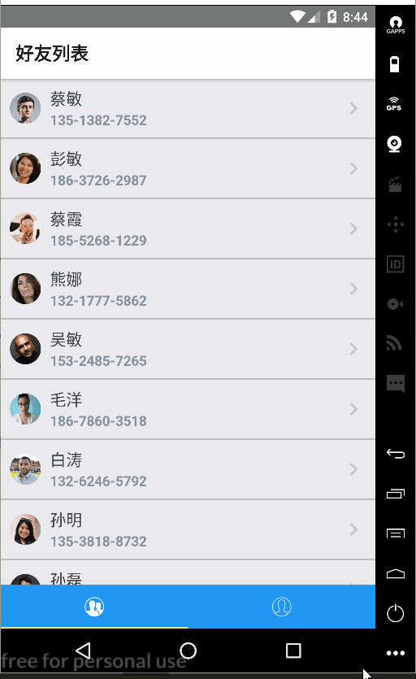

# feedMe通讯录APP

> 一款简易的通讯录APP,用于管理自己的联系人信息.  
> 用来练习react-native-element+react-navigation的使用.

## 运行示例

## 运行步骤
* clone项目到本地
* npm install
* react-native run-android
* 修改./app/config/config.js中BASE_URL字段为终端ip.
* npm run json-server
* npm run start

>PS 如果编译期间出现如下错误:   
> vector-icons Haste package `react-native-vector-icons` was found. However the module `Ionicons` could not be found within the package. Indeed, none of these files exist:     
> 请删除./node_modules/react-native/local-cli/core/__fixtures__/files/package.json.   
> [参考链接](https://github.com/oblador/react-native-vector-icons/issues/626)   
> 重新打包即可运行  

## 实现的功能
>    
> v0.1.0版 
> * 使用json-server配合Mock.js搭建了REST ful后台.
> * 实现了通信列表页和联系人详情2个页面.   
> * 列表页实现了下拉与上滑刷新功能.     
> * 使用react-navigation实现了StackNavigator+TabNavigator.  

## 后续版本功能
* 加入redux,使用redux来进行数据管理.
* 实现修改联系人信息功能.
* 加入导入/导出真实通讯录的功能

## 所用的组件
* react-native-elements
* react-navigation
* react-native-vector-icons
* json-server
* mockjs
* lodash
* query-string

